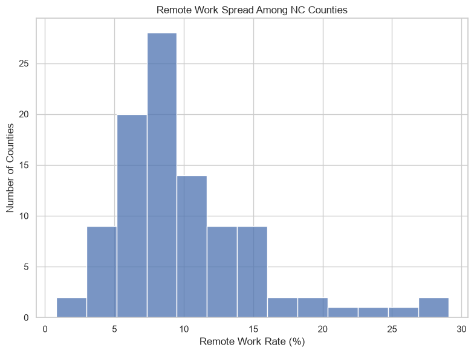
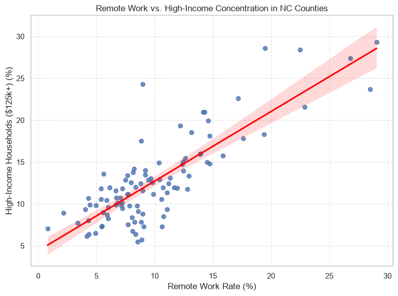

# Project 1 

## 1. Problem Definition

**Research Question:** How does the number of remote workers relate to the amount of high income households in counties across North Carolina?

**Context:** Since the Covid-19 pandemic there has been an increasing prevelance of people working from home across the United States. Remote work has transformed from a temporary solution to avoid getting sick to a permanent feature of the modern labor market. As higher income members of the workforce are attaining flexibility in where they live and work, there will be major impacts of local economies all over the country. I looked at this data to see trends among high income areas and their remote workers across North Carolina.

**Relevance:** This is important because there could be major impacts on local economies as workers, especially more affluent workers, can start living anywhere they want. Local governments could use this to determine possible plans to adapt to the changing working environment.


---

## 2. Data Description

**Variables:** I chose a total of 3 Variables to focus on for this project.
  * Name: The name of the county that the data is describing
  * Remote Workers Percentage: The percentage of the workforce in a given county that do their work from home rather than a physical office. This is determined by taking the estimated total number of workers that worked from home and deviding it by the estimated total number of workers over 16 years old in a given county and multiplying that number by 100.
  * High Income Household Percentage: The proportion of households in a county whose annual household income exceeds $150,000. This is determined by adding the estimated number of households with an income between $150,000-$199,999 to the estimated number of households with an income greater than $200,000, then deviding that number by the estimated total number of households in the given county and multiplying it by 100.

**Data Source:** The data used in this project is from the [US Census Bureau ACS 5-Year Data](https://www.census.gov/data/developers/data-sets/acs-5year.html)
United States Census Bureau. (2022, December 6). American Community Survey 5-Year Data (2009-2017). Census.Gov. https://www.census.gov/data/developers/data-sets/acs-5year.html

**Dataset Characteristics:**
  **Data Representation:** Each row of data represents the data for a certain county in North Carolina
  **Dataset Size:** The dataset is 100 rows of data, one for each county in North Carolina.
  **Data Assumptions:** The data assumes that the sample that was used to create this data is representative of the whole county. The data also might be self reported, meaning that there could be inaccuracies in the actual collected data.


---

## 3. Data Cleaning and Preparation

### The first step was to load the data with my chosen variables into a pandas dataframe
```python
variables = ",".join( {
    "NAME",         #County Name
    "B08301_001E",  #Total Workforce (Ages 16 and Older)
    "B08301_021E",  #Workers Who Worked From Home
    "B19001_001E",  #Total Households
    "B19001_015E",  #Household Earnings $150,000 - $199,999
    "B19001_017E"   #Household Earnings $200,000+
})

url = f"https://api.census.gov/data/2024/acs/acs5?get={variables}&for=county:*&in=state:37&key={API_KEY}"

response = requests.get(url)
data = response.json()
df = pd.DataFrame(data[1:], columns=data[0])
df.head()
```

### The next step is to check for null variables
```python
df.isnull().sum()
```
There were no missing variables in any of the data so there was no need to drop any data

### After that I checked the data types of my variables and set the necessary variables to numeric variables
```python
df.dtypes

numeric_cols=['B08301_021E', 'B08301_001E', 'B19001_001E', 'B19001_017E', 'B19001_015E']

for col in numeric_cols:
    df[col] = pd.to_numeric(df[col], errors="coerce")
```

### The final step in preparing the data was to combine the base variables into the desired variables and rename the variables to look nicer
```python
df['Remote_Work_Pct'] = (df['B08301_021E'] / df['B08301_001E']) * 100

df['High_Income_Pct'] = ((df['B19001_015E'] + df['B19001_017E']) / df['B19001_001E']) * 100

df = df.rename(columns={
    'B08301_001E': 'Total Workforce', 
    'B08301_021E': 'Remote Workers', 
    'B19001_001E': 'Total Households', 
    'B19001_015E' : 'Household Income $150k-$199k', 
    'B19001_017E': 'Household Income $200k+'
    })

df.head()
```
The first part of this step needed to happen so that we could use the desired variable stated in the data description section.


---

## 4. Visualizations and Insights



This histogram shows the distribution of remote work rates in counties across North Carolina.
The graph is strongly right skewed showing that there are some major outliers that have higher remote work rates than the rest of the counties.
We can see that most counties have somewhere between 5% and 12% remote work rates.



This scatter plot shows the relationship between the percentage of remote workers and the percentage of high income households in counties in North Carolina.
There is a clear positive linear correlation between the two variables. There is also a large cluster between the 5%-15% high income ratio and 5%-12% remote work ratio.


---

## 5. Conclusion

The visual analysis answers the research question by showing a strong positive correlation between the percentage of remote workers and high income households in counties across North Carolina. The graphs show that while remote work is prevalent most counties are still between 5% and 12% remote working rates. There are however some counties that have much higher work from home rates reaching nearly 30%. It would be incorrect, however, to assume that this means that because of the high income prevalence that more people work from home. Correlation does not mean causation because the reason for the high correlation might be because of another feature that I did not represent such as the type of industries that are in certain counties.


---

## 6. Limitations, Ethics, and Reflection

**Limitations:** As I mentioned in the conclusion there could be many other features that affect this correlation such as the major industries in the counties. For example, banking is a major industry in Mecklenburg county and most of those jobs are white collar jobs. As a result lots of people in Mecklenburg county can probably work from home. However some outer banks counties might have fishing as their biggest industry, and it is impossible to fish from home unless you live on a boat.

**Biases:** 
  * **Selection Bias:** This is a self reported survey meaning that certain groups might be underrepresented such as people living in rural areas
  * **Measurement Bias:** Worked from home is a tricky term because lots of people are hybrid workers meaning they both go into the office and work from home which could cause confusion when answering the survey.
  * **Sampling Bias:** The populations vary from county to county so since every count is weighed the same rural counties might skew the data because one person in a rural county is worth more than one person in an urban county in the data.

**Reflection:** If I had more time I could use data from the whole country and not just North Carolina which would give a greater understanding of the issue on a national level. Another improvement I could implement is adding control variables that would help show the true relationship such as industries. I could also show more of a story by taking data from before Covid-19 and after Covid-19 to show how much remote work has changed.

---

## Jupyter Notebook, Citations, and AI Transparency

[Jupyter Notebook File](../notebooks/Project 1.html)

### Citations & References
United States Census Bureau. (2022, December 6). American Community Survey 5-Year Data (2009-2017). Census.Gov. https://www.census.gov/data/developers/data-sets/acs-5year.html

Pabilonia, S. W., & Redmond, J. J. (2024, October 31). The rise in remote work since the pandemic and its impact on productivity. Bureau of Labor Statistics. https://www.bls.gov/opub/btn/volume-13/remote-work-productivity.htm

DeBellis, Jeff. NC’s Most Popular Places for Working from Home: 2023 Update. (2025, March 4). Nc.Gov. https://www.commerce.nc.gov/news/the-lead-feed/nc-most-popular-places-to-work-from-home

### AI Usage Disclosure
Google Gemini was used as a code debugger and writing assistant to help create this project:

* **Code Debugging & Structuring:** Assisted in syntax troubleshooting and data processing steps
* **Text Formatting & Editing:** Provided help in structuring the GitHub file and helped refine descriptions for the graphs.
