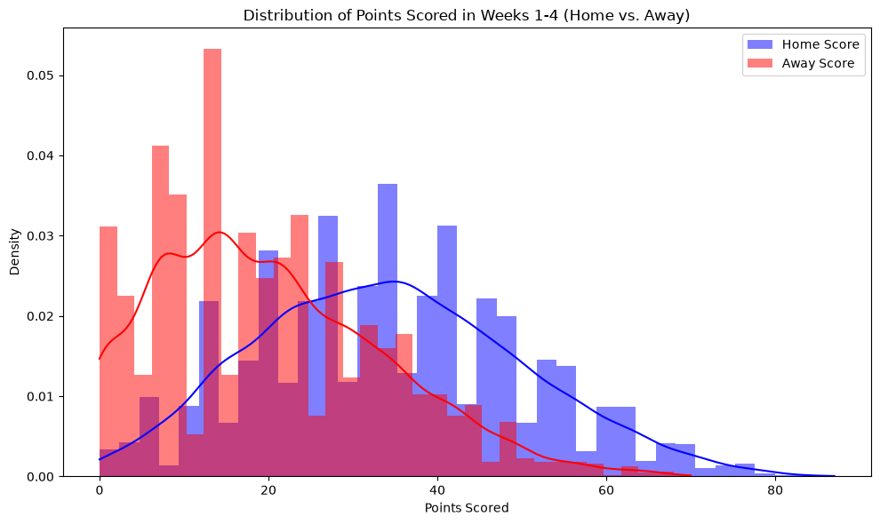
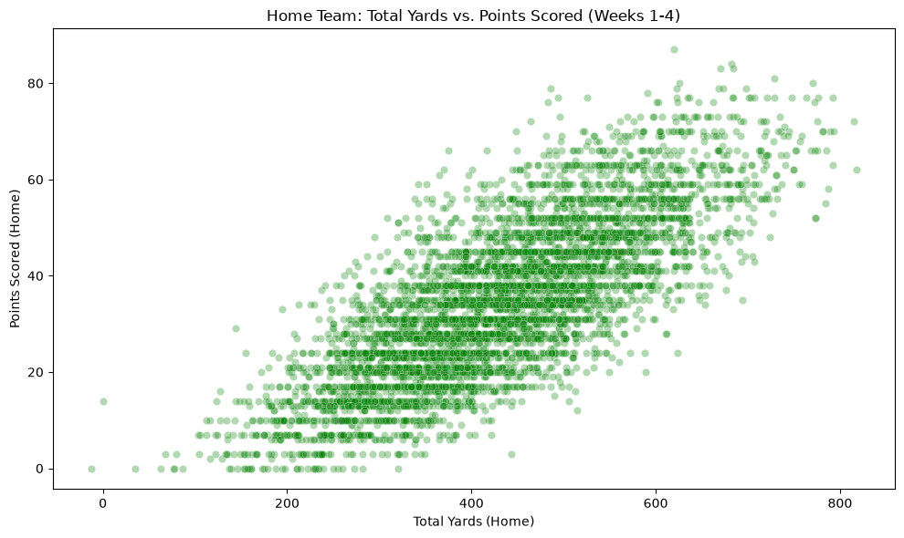
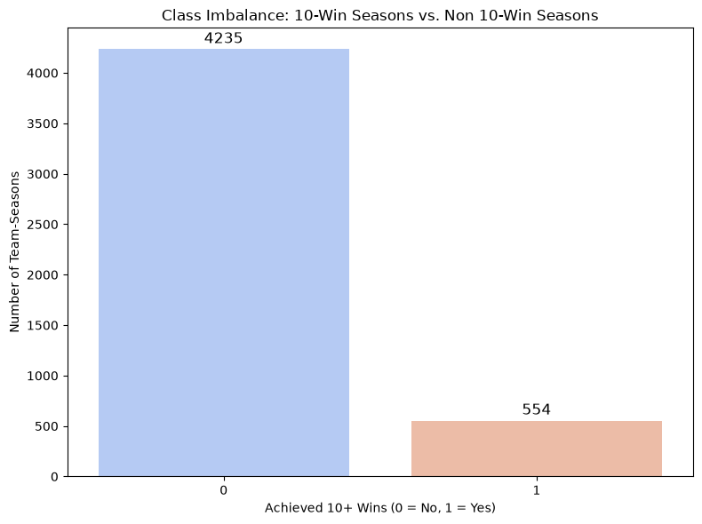
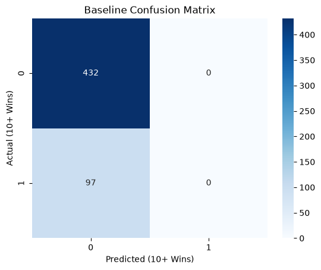
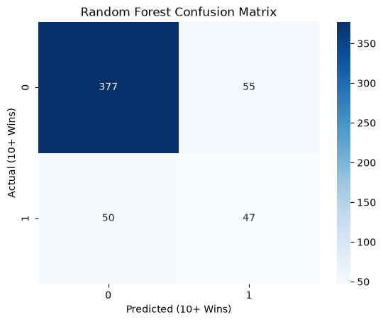

# Project 2

## 1. Problem Definition

**Prediction Problem:** Can I Predict Whether a D1 FBS College Football Team Will Win 10 or More Games in a Given Season Using The Team's Performance in the First 4 Weeks of the Season?

**Target Variable:** Does a team have 10 or more wins in one season (target_10_wins).

**Classification or Regression:** The variable target_10_wins is either yes or no meaning it would be a classification problem.

**Who Benefits:** This model can be beneficial for analysts trying to predict which teams have the best chance of having a successful season. It can also be used by athletic directors and coaches to help make predictions on the results of the season to determine financial planning for the future or start planning for the next season.

**Importance:** Identifying a successful season early can help teams plan for recruiting and marketing and take early advantage of the benefits and prestige that comes with being a team that has a 10 win season.

---

## 2. Background and Context

**Background:** In division 1 college football, there are two different subdivisions, the Football Championship Subdivision (FCS) and the more prestigious of the two the Football Bowl Subdivision (FBS). In the FBS having a 10 or more win season is a marker for a team being one of the best college football teams in the country. During the first four weeks of the season teams play their out of conference games which can sometimes lead to large differences in the teams' skill levels. Many teams pay teams from the FCS to play against them in the first two weeks of the season to gain some almost guaranteed wins and show off their new team. The more competitive games start around week 5-6 when conference play starts and the teams become more evenly matched.

**Previous Knowledge:** From watching college football growing up, I understand that the first one or two games of almost all FBS teams are blow outs that can be won by almost 70 points. After that games get more difficult, but the season does not seem to get super serious until the conference games start. So I wanted to see how important these first few games are to a team's overall success in the season.

**Relevant Variables or Patterns:** In college football there are many statistics. One might think the most important statistics are wins and losses, however, the more advanced statistics like turnover margins and third down conversion rate tell a more complete story (Daily Iowan, 2026). These statistics show how dominant or how clutch a team is in tense situations. Some other patterns that can affect predictive modeling like this is the fact that football is a dangerous sport and lots of players get unexpectedly injured throughout the season. Also every year hundreds of players enter the transfer portal in search of better opportunities to play football making teams very inconsistent from year to year (Mike Farrel Sports, 2026).

Touchdown Trips. (2025, July 23). College Football Explained: A Beginner’s Guide. Touchdown Trips. https://touchdowntrips.com/college-football-explained-the-complete-guide-for-new-fans/

Promoted Post. (2026). The Most Important Statistics for Predicting College Football Success. The Daily Iowan. https://dailyiowan.com/2026/08/10/the-most-important-statistics-for-predicting-college-football-success/

Staff. (2026, March 11). Is It Easy to Actually Predict the Outcomes of College Football Games? Mike Farrell Sports. https://mikefarrellsports.com/news/is-it-easy-to-actually-predict-the-outcomes-of-college-football-game/


---

## 3. Data Description

**Data Source:** The data used in this project is from the [College Football Game Stats 2002 to January 2026]((https://www.kaggle.com/datasets/cviaxmiwnptr/college-football-team-stats-2002-to-january-2024/data))
cviaxmiwnptr. (2026, January 22). College Football Game Stats 2002 to January 2026. Kaggledatasets. https://www.kaggle.com/datasets/cviaxmiwnptr/college-football-team-stats-2002-to-january-2024

**Dataset Characteristics:**
  **Data Representation:** Each row of data represents one game of college football.
  
  **Dataset Size:** The original dataset is 19843 rows and 60 columns of data.
  
  **Target Variable:** The target variable is the binary classification variable "target_10_wins".
  
  **Possible Features:** The data contains lots of possible features because it has most of the data from that specific game.
  
  **Data Limitations:** Some of the earlier data in this dataset does not contain the advanced statistics and only contains the teams names and the score to the game.


---

## 4. Data Understanding and Exploration

### Import the Necessary Libraries and Load in the Data
```python
import pandas as pd
import numpy as np
import matplotlib.pyplot as plt
import seaborn as sns
from sklearn.dummy import DummyClassifier
from sklearn.model_selection import GridSearchCV, train_test_split
from sklearn.preprocessing import StandardScaler
from sklearn.linear_model import LogisticRegression
from sklearn.ensemble import RandomForestClassifier
from sklearn.metrics import classification_report, precision_recall_curve, f1_score

df = pd.read_csv('../data/cfb_box-scores_2002-2025.csv')
```

### Perform Initial EDA
```python
df.head()

df.shape

df.info()

df.isnull().sum()

df.describe(include='all')
```
Through this initial EDA I learned that the first two years of games were missing the advanced statistics for the games. I also learned what the data distribution of each of the variables looked like.

### Basic Data Visualizations





These visualizations help show how points are scored throughout the first few weeks of the season. The second graph also demonstrates the correlation between the amount of yards gained throughout the first four weeks and the amount of points scored.

### Target Variable Distribution
```python
df['away_win'] = (df['score_away'] > df['score_home']).astype(int)
df['home_win'] = (df['score_home'] > df['score_away']).astype(int)

away_season = df.groupby(['season', 'away'])['away_win'].sum().reset_index()
away_season.rename(columns={'away': 'team', 'away_win': 'wins'}, inplace=True)

home_season = df.groupby(['season', 'home'])['home_win'].sum().reset_index()
home_season.rename(columns={'home': 'team', 'home_win': 'wins'}, inplace=True)

season_wins = pd.merge(away_season, home_season, on=['season', 'team'], how='outer', suffixes=('_away', '_home')).fillna(0)
season_wins['total_wins'] = season_wins['wins_away'] + season_wins['wins_home']
season_wins['target_10_wins'] = (season_wins['total_wins'] >= 10).astype(int)
```


Most teams end up with less than 10 wins in a season therefore the distribution of the target variable (target_10_wins) is skewed toward the teams with under 10 wins.


---

## 5. Data Preparation and Feature Exploration

### Start Selecting Important Variables and Handle Missing Values
```python
first_4 = df[df['week'] <= 4].copy()

fill_cols = ['fum_away', 'int_away', 'fum_home', 'int_home', 'total_yards_away', 'total_yards_home', 'score_away', 'score_home']
first_4[fill_cols] = first_4[fill_cols].dropna()
first_4['home_win'] = (first_4['score_home'] > first_4['score_away']).astype(int)
first_4['away_win'] = (first_4['score_away'] > first_4['score_home']).astype(int)
```
I chose to delete the rows that were missing the advanced statistics. These rows were mostly from the 2002 and 2003 season, so I determined that it would be safer to get rid of the missing statistics instead of replacing them.

### Prepare the Selected Variables to be Used as Features
```python
# Aggregate away stats
away_f4 = first_4.groupby(['season', 'away']).agg(
    away_pts_scored=('score_away', 'sum'),
    away_pts_allowed=('score_home', 'sum'),
    away_yds_gained=('total_yards_away', 'sum'),
    away_yds_allowed=('total_yards_home', 'sum'),
    away_to_lost=('fum_away', lambda x: x.sum() + first_4.loc[x.index, 'int_away'].sum()),
    away_to_gained=('fum_home', lambda x: x.sum() + first_4.loc[x.index, 'int_home'].sum()),
    away_wins=('away_win', 'sum')
).reset_index().rename(columns={'away': 'team'})

# Aggregate home stats
home_f4 = first_4.groupby(['season', 'home']).agg(
    home_pts_scored=('score_home', 'sum'),
    home_pts_allowed=('score_away', 'sum'),
    home_yds_gained=('total_yards_home', 'sum'),
    home_yds_allowed=('total_yards_away', 'sum'),
    home_to_lost=('fum_home', lambda x: x.sum() + first_4.loc[x.index, 'int_home'].sum()),
    home_to_gained=('fum_away', lambda x: x.sum() + first_4.loc[x.index, 'int_away'].sum()),
    home_wins=('home_win', 'sum')
).reset_index().rename(columns={'home': 'team'})

# Merge first 4 weeks stats and combine home/away totals
f4_stats = pd.merge(away_f4, home_f4, on=['season', 'team'], how='outer').dropna()

f4_stats['pts_scored_f4'] = f4_stats['away_pts_scored'] + f4_stats['home_pts_scored']
f4_stats['pts_allowed_f4'] = f4_stats['away_pts_allowed'] + f4_stats['home_pts_allowed']
f4_stats['point_diff_f4'] = f4_stats['pts_scored_f4'] - f4_stats['pts_allowed_f4']

f4_stats['yds_gained_f4'] = f4_stats['away_yds_gained'] + f4_stats['home_yds_gained']
f4_stats['yds_allowed_f4'] = f4_stats['away_yds_allowed'] + f4_stats['home_yds_allowed']
f4_stats['net_yds_f4'] = f4_stats['yds_gained_f4'] - f4_stats['yds_allowed_f4']

f4_stats['to_lost_f4'] = f4_stats['away_to_lost'] + f4_stats['home_to_lost']
f4_stats['to_gained_f4'] = f4_stats['away_to_gained'] + f4_stats['home_to_gained']
f4_stats['to_margin_f4'] = f4_stats['to_gained_f4'] - f4_stats['to_lost_f4']

f4_stats['wins_f4'] = f4_stats['away_wins'] + f4_stats['home_wins']

cols_to_keep = ['season', 'team', 'pts_scored_f4', 'pts_allowed_f4', 'point_diff_f4', 
                'yds_gained_f4', 'yds_allowed_f4', 'net_yds_f4', 'to_margin_f4', 'wins_f4']
model_data = pd.merge(f4_stats[cols_to_keep], 
                      season_wins[['season', 'team', 'target_10_wins']], 
                      on=['season', 'team'], how='inner')
```
In this code I combined the selected statistics from the away games using the team's name and the season. I then repeated the same process for the home teams. Once those were done I combined the home games and the away games to contain all of the first four games of each season. The next step was to combine some of the columns into one column. I did this for point differential (point_diff_f4), net yards (net_yards_f4), turnover margin (to_margin_f4), and amount of wins (wins_f4). The last step was to just keep my final feature variables and prepare the data to be used in a model.

### Split the Data into Training and Testing Data
```python
features = ['point_diff_f4', 'net_yds_f4', 'to_margin_f4', 'pts_scored_f4', 'yds_gained_f4']
X = model_data[features]
y = model_data['target_10_wins']

X_train, X_test, y_train, y_test = train_test_split(X, y, test_size=0.2, random_state=42, stratify=y)

# Scaling Features to prevent variables with larger magnitudes (like yards) from dominating smaller ones (like turnovers)
scaler = StandardScaler()
X_train_scaled = scaler.fit_transform(X_train)
X_test_scaled = scaler.transform(X_test)
```
Split the data 80/20 for the test train split.


---


## 6. Baseline and Model Development

**Baseline:** For my baseline I chose a model that just predicts that the team will not have a 10 win season. I chose this since there is a large class imbalance so by just rejecting every datapoint it got a 82% accuracy
```python
baseline = DummyClassifier(strategy="most_frequent")
baseline.fit(X_train_scaled, y_train)
y_pred_base = baseline.predict(X_test_scaled)
```

**Model Selection:** For the two models I chose to make a logistic regression model and a random forest prediction model. I chose these models because my prediction problem is a classification problem which is the purpose of both of these models. For both of these models I also chose to use GridSearchCV to tune hyperparameters with cross validation. I also chose to have the hyperparameters focus on increasing precision because when I originally tested the model it had abysmal precision scores as it was predicting lots of teams to have 10 or more wins.
```python
log_param_grid = {
    'C': [0.001, 0.1, 1, 10, 100],
    'class_weight': ['balanced']
}

log_model = LogisticRegression(random_state=42)
log_grid = GridSearchCV(log_model, 
                        param_grid=log_param_grid, 
                        scoring='precision', 
                        cv=5, 
                        n_jobs=-1)
log_grid.fit(X_train_scaled, y_train)
y_pred_log = log_grid.predict(X_test_scaled)
best_log = log_grid.best_estimator_

rf_param_grid = {
    'max_depth': [None, 5, 10, 20],
    'n_estimators': [50, 100, 200],
    'min_samples_leaf': [1, 5, 10],
    'class_weight': ['balanced']
}

rf_model = RandomForestClassifier(random_state=42)
rf_grid = GridSearchCV(rf_model, 
                       param_grid=rf_param_grid, 
                       scoring='precision', 
                       cv=5, 
                       n_jobs=-1)
rf_grid.fit(X_train_scaled, y_train)
best_rf = rf_grid.best_estimator_
y_pred_rf = rf_grid.predict(X_test_scaled)
```


---

## 7. Model Evaluation and Selection

**Evaluation Metrics:** For the models I chose to use a classification report to show how my model performed and a confusion matrix to visualize what the actual predictions of the models were.

### Classification Reports
```text
--- Baseline ---
              precision    recall  f1-score   support

           0       0.82      1.00      0.90       432
           1       0.00      0.00      0.00        97

    accuracy                           0.82       529
   macro avg       0.41      0.50      0.45       529
weighted avg       0.67      0.82      0.73       529

--- Logistic Regression ---
              precision    recall  f1-score   support

           0       0.92      0.74      0.82       432
           1       0.39      0.72      0.50        97

    accuracy                           0.74       529
   macro avg       0.65      0.73      0.66       529
weighted avg       0.82      0.74      0.76       529

--- Random Forest ---
              precision    recall  f1-score   support

           0       0.88      0.87      0.88       432
           1       0.46      0.48      0.47        97

    accuracy                           0.80       529
   macro avg       0.67      0.68      0.68       529
weighted avg       0.81      0.80      0.80       529
```

### Confusion Matrices






**Final Model:** For my final model I chose the random forest model because all three of the models did not perform very well, however, the random forest model actually predicted something with the most balanced results. The random forest model has very similar precision, recall, and f1 scores whereas the logistic regression model has a much better recall, but has a much worse precision. Also the accuracy on the random forest model is higher than the accuracy on the logistic regression model.  


---

## 8. Model Interpretation and Insights

My model that I created did not perform very well which is not something too unexpected. Many unexpected issues can occur in the middle of a season such as a star player getting injured or a coach getting fired that could cause a team that looked good early in the season to not perform so well later in the season. The model shows that there is some importance behind the first few non conference games that could demonstrate that a team has what it takes to make it to 10 wins. However, the model performing poorly shows that the conference are very important to a team's overall success. 


---

## 9. Limitations, Ethics, and Reflection

**Limitations:** One limitation in the project is the major class imbalance of the target variable not giving the model enough data to truly learn what patterns it should look for in a 10 win team. One other limitation in the data is that the first two seasons of the data did not have the advanced statistics that the model was trained on. If the model had two more seasons of data to train on it might have performed better.

**Biases:** 
  * **Historical Bias:** Larger programs with better recruiting and more funding typically get better players and go on to have 10 win seasons often.
  * **Selection Bias:** Early season statistics like points and yards can be inflated by playing weak teams such as FCS teams.

**Reflection:** This model would be better for actual decision making if I had taken the whole data from the previous year to predict the amount of wins in the given year. I also should have included strength of schedule to make the model perform better. Also people should understand that in sports there is lots of room for the inconsistencies that comes with humans to make a model's predictions incorrect. 

---

## Jupyter Notebook, Citations, and AI Transparency

[Jupyter Notebook File](../Project_2.html)

### Citations & References

Promoted Post. (2026). The Most Important Statistics for Predicting College Football Success. The Daily Iowan. https://dailyiowan.com/2026/08/10/the-most-important-statistics-for-predicting-college-football-success/

Staff. (2026, March 11). Is It Easy to Actually Predict the Outcomes of College Football Games? Mike Farrell Sports. https://mikefarrellsports.com/news/is-it-easy-to-actually-predict-the-outcomes-of-college-football-game/

Touchdown Trips. (2025, July 23). College Football Explained: A Beginner’s Guide. Touchdown Trips. https://touchdowntrips.com/college-football-explained-the-complete-guide-for-new-fans/

### AI Usage Disclosure
Google Gemini was used as a coding assistant in this project:

* **Coding Assistance:** Assisted with syntax of the data preprocessing, creating hyperparameters, and creating visualizations
