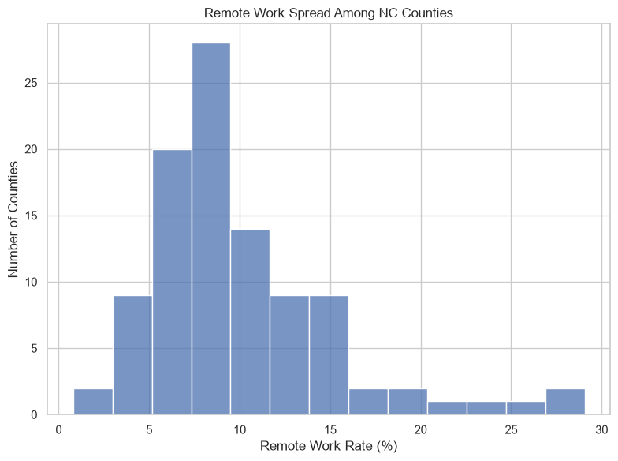
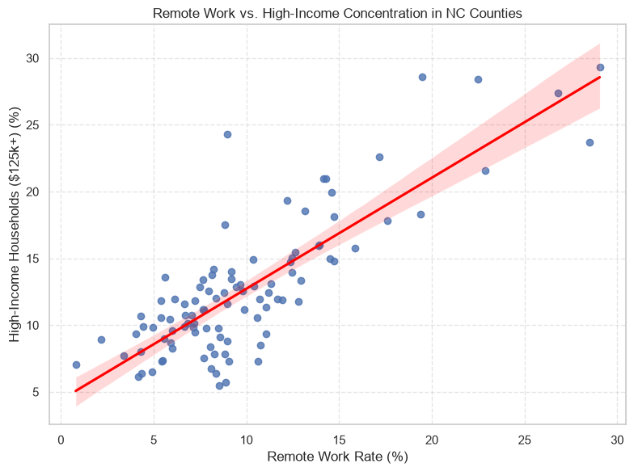

# Project 2

## 1. Problem Definition

**Prediction Problem:** Can I Predict Whether a D1 FBS College Football Team Will Win 10 or More Games in a Given Season Using The Team's Performance in the First 4 Weeks of the Season?
**Target Variable:** Does a team have 10 or more wins in one season (target_10_wins).
**Classification or Regression:** The variable target_10_wins is either yes or no meaning it would be a classification problem.
**Who Benefits:** This model can be beneficial for analysts trying to predict which teams have the best chance of having a successful season. It can also be used by athletic directors and coaches to help make predictions on the results of the season to determine financial planning for the future or start planning for the next season.
**Importance:** Identifying a successful season early can help teams plan for recruiting and marketing and take early advantage of the benefits and prestige that comes with being a team that has a 10 win season.

---

## 2. Background and Context

**Background:** In division 1 college football, there are two different subdivisions, the Football Championship Subdivision (FCS) and the more prestigious of the two the Football Bowl Subdivision (FBS). In the FBS having a 10 or more win season is a marker for a team being one of the best college football teams in the country. During the first four weeks of the season teams play their out of conference games which can sometimes lead to large differences in the teams' skill levels. Many teams pay teams from the FCS to play against them in the first two weeks of the season to gain some almost guaranteed wins and show off their new team. The more competitive games start around week 5-6 when conference play starts and the teams become more evenly matched.
**My Previous Knowledge:** From watching college football growing up, I understand that the first one or two games of almost all FBS teams are blow outs that can be won by almost 70 points. After that games get more difficult, but the season does not seem to get super serious until the conference games start. So I wanted to see how important these first few games are to a team's overall success in the season.
**Relevant Variables or Patterns:** In college football there are many statistics. One might think the most important statistics are wins and losses, however, the more advanced statistics like turnover margins and third down conversion rate tell a more complete story (Daily Iowan, 2026). These statistics show how dominant or how clutch a team is in tense situations. Some other patterns that can affect predictive modeling like this is the fact that football is a dangerous sport and lots of players get unexpectedly injured throughout the season. Also every year hundreds of players enter the transfer portal in search of better opportunities to play football making teams very inconsistent from year to year (Mike Farrel Sports, 2026).

admin_ryan. (2025, July 23). College Football Explained: A Beginner’s Guide. Touchdown Trips. https://touchdowntrips.com/college-football-explained-the-complete-guide-for-new-fans/
Promoted Post. (2026). The Most Important Statistics for Predicting College Football Success. The Daily Iowan. https://dailyiowan.com/2026/08/10/the-most-important-statistics-for-predicting-college-football-success/
Staff. (2026, March 11). Is It Easy to Actually Predict the Outcomes of College Football Games? Mike Farrell Sports. https://mikefarrellsports.com/news/is-it-easy-to-actually-predict-the-outcomes-of-college-football-game/


---

## 3. Data Description

**Data Source:** The data used in this project is from the [College Football Game Stats | 2002 to January 2026]((https://www.kaggle.com/datasets/cviaxmiwnptr/college-football-team-stats-2002-to-january-2024/data))
cviaxmiwnptr. (2026, January 22). College Football Game Stats | 2002 to January 2026. Kaggledatasets. https://www.kaggle.com/datasets/cviaxmiwnptr/college-football-team-stats-2002-to-january-2024

**Dataset Characteristics:**
  **Data Representation:** Each row of data represents one game of college football.
  **Dataset Size:** The original dataset is 19843 rows and 60 columns of data.
  **Target Variable:** The target variable is the binary classification variable "target_10_wins".
  **Possible Features:** The data contains lots of possible features because it has most of the data from that specific game.
  **Data Limitations:** Some of the earlier data in this dataset does not contain the advanced statistics and only contains the teams names and the score to the game.


---

## 4. Data Understanding and Exploration

### Import the Necessary libraries and load in the data
```python
import pandas as pd
import numpy as np
import matplotlib.pyplot as plt
import seaborn as sns
from sklearn.dummy import DummyClassifier
from sklearn.model_selection import GridSearchCV, train_test_split
from sklearn.preprocessing import StandardScaler
from sklearn.linear_model import LogisticRegression
from sklearn.ensemble import RandomForestClassifier
from sklearn.metrics import classification_report, precision_recall_curve, f1_score

df = pd.read_csv('../data/cfb_box-scores_2002-2025.csv')
```

### Perform some initial EDA
```python
df.head()

df.shape

df.info()

df.isnull().sum()

df.describe(include='all')
```
Through this initial EDA I learned that the first two years of games were missing the advanced statistics for the games. I also learned what the data distribution of each of the variables looked like.

### Basic Data Visualizations


### The final step in preparing the data was to combine the base variables into the desired variables and rename the variables to look nicer


The first part of this step needed to happen so that we could use the desired variable stated in the data description section.


---

## 5. Data Preparation and Feature Exploration


---


## 6. Baseline and Model Development


This histogram shows the distribution of remote work rates in counties across North Carolina.
The graph is strongly right skewed showing that there are some major outliers that have higher remote work rates than the rest of the counties.
We can see that most counties have somewhere between 5% and 12% remote work rates.



This scatter plot shows the relationship between the percentage of remote workers and the percentage of high income households in counties in North Carolina.
There is a clear positive linear correlation between the two variables. There is also a large cluster between the 5%-15% high income ratio and 5%-12% remote work ratio.


---

## 7. Model Evaluation and Selection


---

## 8. Model Interpretation and Insights

The visual analysis answers the research question by showing a strong positive correlation between the percentage of remote workers and high income households in counties across North Carolina. The graphs show that while remote work is prevalent most counties are still between 5% and 12% remote working rates. There are however some counties that have much higher work from home rates reaching nearly 30%. It would be incorrect, however, to assume that this means that because of the high income prevalence that more people work from home. Correlation does not mean causation because the reason for the high correlation might be because of another feature that I did not represent such as the type of industries that are in certain counties.


---

## 6. Limitations, Ethics, and Reflection

**Limitations:** As I mentioned in the conclusion there could be many other features that affect this correlation such as the major industries in the counties. For example, banking is a major industry in Mecklenburg county and most of those jobs are white collar jobs. As a result lots of people in Mecklenburg county can probably work from home. However some outer banks counties might have fishing as their biggest industry, and it is impossible to fish from home unless you live on a boat.

**Biases:** 
  * **Selection Bias:** This is a self reported survey meaning that certain groups might be underrepresented such as people living in rural areas
  * **Measurement Bias:** Worked from home is a tricky term because lots of people are hybrid workers meaning they both go into the office and work from home which could cause confusion when answering the survey.
  * **Sampling Bias:** The populations vary from county to county so since every count is weighed the same rural counties might skew the data because one person in a rural county is worth more than one person in an urban county in the data.

**Reflection:** If I had more time I could use data from the whole country and not just North Carolina which would give a greater understanding of the issue on a national level. Another improvement I could implement is adding control variables that would help show the true relationship such as industries. I could also show more of a story by taking data from before Covid-19 and after Covid-19 to show how much remote work has changed.

---

## Jupyter Notebook, Citations, and AI Transparency

[Jupyter Notebook File](../Project_1.html)

### Citations & References
United States Census Bureau. (2022, December 6). American Community Survey 5-Year Data (2009-2017). Census.Gov. https://www.census.gov/data/developers/data-sets/acs-5year.html

Pabilonia, S. W., & Redmond, J. J. (2024, October 31). The rise in remote work since the pandemic and its impact on productivity. Bureau of Labor Statistics. https://www.bls.gov/opub/btn/volume-13/remote-work-productivity.htm

DeBellis, Jeff. NC’s Most Popular Places for Working from Home: 2023 Update. (2025, March 4). Nc.Gov. https://www.commerce.nc.gov/news/the-lead-feed/nc-most-popular-places-to-work-from-home

### AI Usage Disclosure
Google Gemini was used as a code debugger and writing assistant to help create this project:

* **Code Debugging & Structuring:** Assisted in syntax troubleshooting and data processing steps
* **Text Formatting & Editing:** Provided help in structuring the GitHub file and helped refine descriptions for the graphs.
